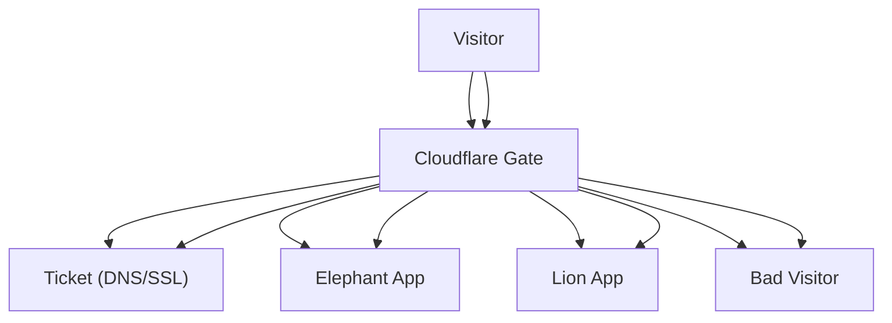

# Cloudflare Design & Training Guide

**Objective:** Familiarity with Cloudflare (Workers, Queues, DNS, etc.)

---

## Cloudflare (Zoo Analogy)

Imagine your zoo has a super-fast security guard and traffic controller (Cloudflare) at the gate. The guard checks every visitor, keeps out troublemakers, and makes sure everyone gets to the right animal quickly—even if there's a big crowd!

- Security guard = Cloudflare
- Visitors = Web requests
- Animals = Your apps/services
- Zoo = Your infrastructure

---

## Cloudflare Analogy & Workflow (Mermaid Diagram)

---

## Quick Start
- **Sign up for Cloudflare**
- **Add your domain**
- **Set up DNS records**
- **Deploy a Worker**
- **Configure security (WAF, SSL, etc.)**

---

## Best Practices
- Use Workers for edge logic
- Protect sensitive endpoints with firewall rules
- Use environment variables and secrets
- Monitor traffic and errors
- Keep DNS records up to date

---

## Deep Dive: Advanced Cloudflare
- **Queues:** Manage lines of visitors (messages)
- **Durable Objects:** Special animal enclosures with memory
- **KV Storage:** Store treats (data) for animals
- **Rate Limiting:** Limit how many visitors can see each animal
- **Analytics:** Watch visitor patterns and optimize

---

**For questions or more training, reach out to your DevOps or infrastructure team!** 
