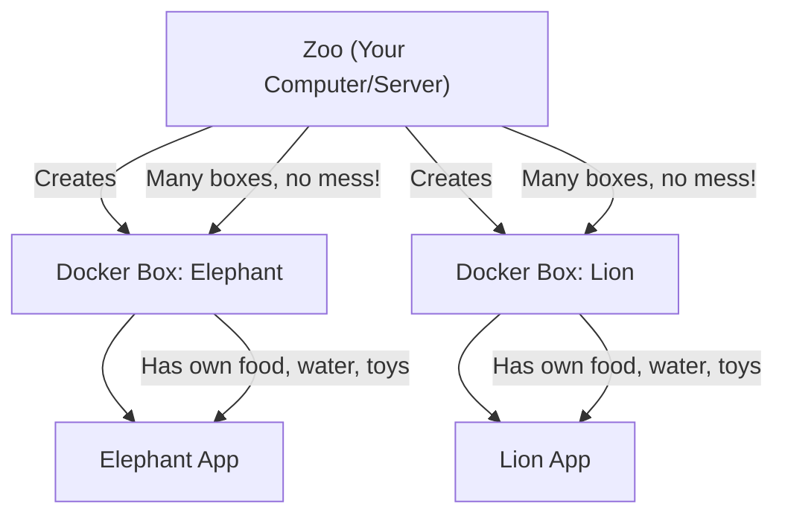

# Docker Design & Training Guide

**Objective:** Familiarity and mastery of Docker for all team members

---

## 1. Docker (Zoo Analogy)

Imagine a zoo. In this zoo, every animal has its own special home (enclosure) with everything it needs: food, water, toys, and even the right temperature. Now, imagine you want to bring a big elephant to your zoo. Instead of building a new home from scratch every time, you have a magical box. Whenever you want an elephant, you just open the box and—poof!—a perfect elephant home appears, ready to use, with everything set up just right.

**Docker is like that magical box.**
- Each animal = an application
- The box = a Docker container
- The home setup = everything the app needs (code, libraries, settings)
- The zoo = your computer or server

You can have many elephants (apps) running, each in their own box, and they never mess with each other!

Below comes ton of code, which you do not have to remember



---

## 2. Essential Docker Commands for Our Company

- **Start everything (build if needed):**
  ```bash
  docker-compose up --build
  ```
- **See running containers:**
  ```bash
  docker ps
  ```
- **Stop everything:**
  ```bash
  docker-compose down
  ```

---

## 3. Sample Dockerfile (Executable Example)

```Dockerfile
# Use official Python image
FROM python:3.11-slim

WORKDIR /app

# Copy requirements and install dependencies
COPY requirements.txt .
RUN pip install -r requirements.txt

# Copy the rest of the code
COPY . .

# Run the app
CMD ["python", "main.py"]
```

---

## 4. Sample docker-compose.yml (Executable Example)

```yaml
version: '3.8'
services:
  web:
    build: .
    ports:
      - "8000:8000"
    volumes:
      - .:/app
    environment:
      - ENV=development
    healthcheck:
      test: ["CMD", "curl", "-f", "http://localhost:8000/"]
      interval: 30s
      timeout: 10s
      retries: 3
```

---

## 5. Minimal App Example (for Executability)

**requirements.txt**
```
fastapi
uvicorn
```

**main.py**
```python
from fastapi import FastAPI
app = FastAPI()

@app.get("/")
def read_root():
    return {"Hello": "World"}
```

---

## 6. Why Use Docker?
- **Consistency:** "It works on my machine" becomes "It works everywhere."
- **Isolation:** Each app runs in its own box, so no conflicts.
- **Portability:** Move your app from laptop to server to cloud with no changes.
- **Scalability:** Start more boxes when you need more elephants!
- **Easy onboarding:** New team members can start with one command.

We only need this much, but if you are.....

## 7. Hungry for More? Dig In!

- [Docker Official Documentation](https://docs.docker.com/)
- [Docker Compose Docs](https://docs.docker.com/compose/)
- [Play with Docker (free online lab)](https://labs.play-with-docker.com/)

---

## 8. Deep Dive: Docker Internals & Advanced Usage

### 8.1. Multi-Stage Build Example (Best Practice)
```Dockerfile
# First stage: build dependencies
FROM python:3.11-slim AS builder
WORKDIR /app
COPY requirements.txt .
RUN pip install --user -r requirements.txt

# Second stage: final image
FROM python:3.11-slim
WORKDIR /app
COPY --from=builder /root/.local /root/.local
COPY . .
ENV PATH=/root/.local/bin:$PATH
CMD ["python", "main.py"]
# This Dockerfile uses multi-stage builds to keep the final image small.
```

### 8.2. Custom Entrypoint Script
```Dockerfile
# Add a custom entrypoint script
COPY entrypoint.sh /entrypoint.sh
RUN chmod +x /entrypoint.sh
ENTRYPOINT ["/entrypoint.sh"]
# entrypoint.sh can set up environment, run migrations, then start the app
```

**entrypoint.sh**
```bash
#!/bin/bash
# Example entrypoint script
set -e

# Run database migrations (if any)
# alembic upgrade head

echo "Starting app..."
exec "$@"
```

### 8.3. Healthcheck in Dockerfile
```Dockerfile
HEALTHCHECK --interval=30s --timeout=10s --retries=3 \
  CMD curl -f http://localhost:8000/ || exit 1
# This adds a healthcheck to the container itself.
```

### 8.4. Bind Mounts and Volumes
```yaml
services:
  web:
    volumes:
      - ./data:/app/data  # Bind mount for persistent data
      - my_named_volume:/app/logs  # Docker-managed volume
volumes:
  my_named_volume:
```

### 8.5. Environment Variables and Secrets
```yaml
environment:
  - ENV=production
  - SECRET_KEY=${SECRET_KEY}
# Use .env files or CI/CD secrets for sensitive values
```

### 8.6. Debugging and Monitoring
```bash
# View logs for a container
$ docker logs <container-id>

# View resource usage
$ docker stats

# Attach to a running container
$ docker exec -it <container-id> /bin/bash
```

### 8.7. Building and Pushing Images
```bash
# Build an image with a tag
$ docker build -t myapp:latest .

# Push to Docker Hub
$ docker push myapp:latest
```

### 8.8. Advanced Compose Features
```yaml
services:
  web:
    build: .
    depends_on:
      - db
  db:
    image: postgres:15
    environment:
      - POSTGRES_PASSWORD=example
# 'depends_on' ensures db starts before web
```

---

## 9. Conclusion

Docker is your magical zoo box: it makes development, testing, and deployment easier, faster, and more reliable. Master these basics and deep dives, and you'll be ready to handle any "elephant" your team needs to run!

---

**For questions or more training, reach out to your DevOps team!** 
