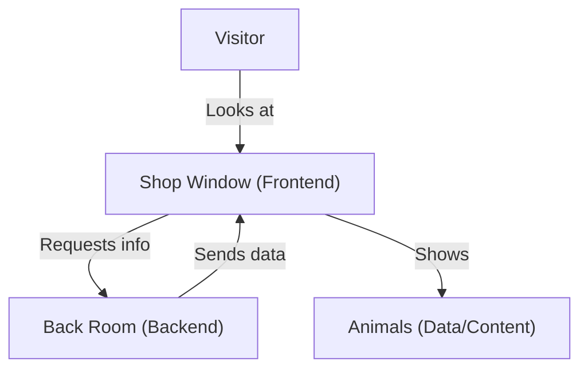

# Frontend Best Practices Design & Training Guide

**Objective:** Secure, maintainable, and performant frontend development

---

## Frontend (Zoo Analogy)

Imagine the zoo has a beautiful shop window (frontend) where visitors see animals, buy tickets, and get information. But the real work—feeding animals, keeping them safe, and handling money—happens in the back room (backend), where visitors can't go!

- Shop window = Frontend (React/Vue/etc.)
- Back room = Backend (APIs, servers)
- Visitors = Users
- Animals = Data/content

---

## Frontend Analogy & Workflow (Mermaid Diagram)



---

## Quick Start
- **Create a new project:**
  ```bash
  npx create-react-app my-app
  # or
  npm create vite@latest my-app
  ```
- **Run the app:**
  ```bash
  npm start
  ```
- **Connect to backend via API calls**

---

## Best Practices
- Never put secrets or business logic in the frontend
- All sensitive operations must go through the backend
- Validate all user input on the backend
- Use HTTPS for all API calls
- Keep UI responsive and accessible
- Use environment variables for config (but never for secrets)

---

## Deep Dive: Advanced Frontend
- **SSR/SSG:** Pre-render shop windows for faster loading
- **Code splitting:** Only show what's needed, when needed
- **Security:** Prevent XSS, CSRF, and other attacks
- **Testing:** Automated tests for every window and button
- **Performance:** Lazy loading, caching, optimizing images
- **Accessibility:** Make the zoo welcoming for everyone

---

**For questions or more training, reach out to your frontend or UX team!** 
